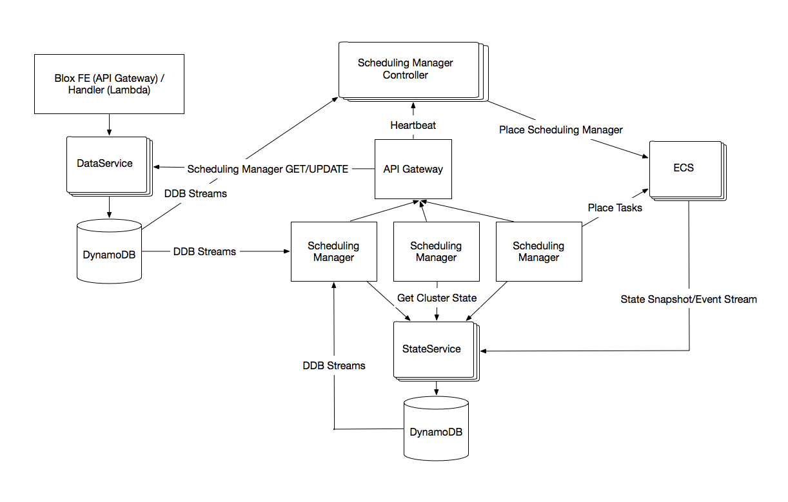
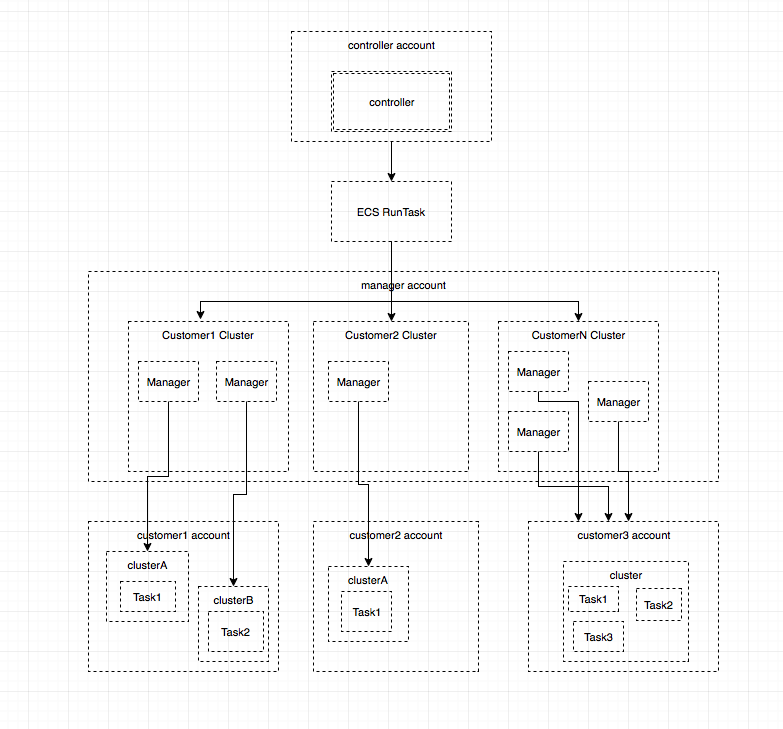

# Daemon Scheduler

<!-- TOC depthFrom:2 depthTo:6 withLinks:1 updateOnSave:1 orderedList:0 -->

- [Introduction](#introduction)
- [What is a daemon scheduler?](#what-is-a-daemon-scheduler)
- [Scope](#scope)
- [User Experience](#user-experience)
	- [Starting a Deployment](#starting-a-deployment)
	- [Updating a deployment](#updating-a-deployment)
	- [Rolling back a deployment](#rolling-back-a-deployment)
	- [Stopping a deployment](#stopping-a-deployment)
	- [Deleting an environment](#deleting-an-environment)
	- [Getting deployment and environment state](#getting-deployment-and-environment-state)
- [Design](#design)
	- [Architecture](#architecture)
	- [Service Descriptions](#service-descriptions)
		- [Blox Frontend](#blox-frontend)
		- [Data Service](#data-service)
		- [State Service](#state-service)
		- [Scheduling Manager Controller](#scheduling-manager-controller)
		- [Scheduling Manager](#scheduling-manager)
		- [Scheduler (currently part of the scheduling manager, can be split out later)](#scheduler-currently-part-of-the-scheduling-manager-can-be-split-out-later)
	- [Service Design](#service-design)
		- [Frontend](#frontend)
			- [APIs](#apis)
		- [Data Service](#data-service)
			- [Data Model](#data-model)
		- [Queries](#queries)
		- [State Service](#state-service)
		- [Scheduling Manager Controller](#scheduling-manager-controller)
			- [Manager Creation](#manager-creation)
			- [Monitoring and Lifecycle](#monitoring-and-lifecycle)
			- [Infrastructure](#infrastructure)
		- [Scheduling Manager](#scheduling-manager)
			- [Pending Deployments](#pending-deployments)
			- [In-Progress Deployments](#in-progress-deployments)
			- [Monitoring State](#monitoring-state)
			- [Deleting environments](#deleting-environments)
- [Security](#security)
	- [Key data flows](#key-data-flows)
	- [Potential threats and mitigations](#potential-threats-and-mitigations)
		- [Scheduler DoS](#scheduler-dos)
	- [Malicious callers](#malicious-callers)
	- [Data security](#data-security)
	- [Network security](#network-security)

<!-- /TOC -->

## Introduction
This is a proposal for a managed open source daemon scheduler that will be part of the  ECS service. Customers will be able to use this scheduler the same way they use other AWS services: by making calls to the service using the AWS console, CLI/SDKs. Customers will also be able to see the code and will have visibility into architectural decisions and will have the option to modify the code to better fit their use case.

## What is a daemon scheduler?
A daemon scheduler ensures that one and only one instance of the task runs on every specified instance (every instance in the cluster or every instance matching the provided attribute). As instances matching the attribute are added to the cluster, the daemon scheduler starts tasks on the new instances. It cleans up tasks on instances that leave the cluster. It also monitors the health of the started tasks and restarts them if they die.

Common use cases for a daemon scheduler include running log collection, monitoring or storage (file system or database) daemons.

## Scope
The following design focuses on a daemon scheduler while also giving a high level overview of how the service and other schedulers will fit into this architecture.

The following is in the scope for this design:
*	start deployment: deploys one task on every instance of the cluster or use attributes to specify certain instances in the cluster
*	stop deployment
*	update deployment with new task definition or changing the instances the tasks are deployed on
*	ensure that the same task is not launched on the same instance by different deployments
*	daemon monitor to ensure all instances are running one copy of the task
	*	launch a task on new instances that join the cluster
	*	restart the task if it dies
*	task cleanup when an instance is removed from the cluster
*	expose deployment state and task health: 2 active, 3 launching, 1 unhealthy

Out of scope for v1:
*	preemption in case of resource unavailability
*	ensure daemon tasks are launched before any other tasks
*	events/notifications
*	extension points
*	healthchecks (including custom healthcheck scripts)

## User Experience
Users interact with the scheduler by using **deployment** and **environment** APIs. An **environment** is an object that contains the configuration and metadata about deployments. An environment is what defines what type of scheduler will be running in a cluster (service, daemon, cron) and how it will be rolled out (deployment preferences). A **deployment** is what places tasks in the cluster.

Modeling the APIs around deployments gives users the flexibility to start, stop, rollback and update deployments, and also control how they want their tasks to be updated and rolled back on instances during a deployment simply by providing deployment configuration. By keeping the APIs generic around deployments, we can add additional schedulers in the future but keep the interface and APIs consistent across scheduler types.

### Starting a Deployment
To start deploying tasks, users need to create an environment.
```
CreateEnvironmentResponse CreateEnvironment(CreateEnvironmentRequest)

CreateEnvironmentRequest {
    Name: string
    TaskDefinition: string
    InstanceGroup: InstanceGroup
    Role: string
    DeploymentConfiguration: DeploymentConfiguration
}

CreateEnvironmentResponse {
    EnvironmentVersion: uuid // deployable version of the environment
}

InstanceGroup {
    Cluster: string
    Attributes: list of string (optional)
}

ServiceDeploymentConfiguration isA DeploymentConfiguration {
    LoadBalancer: string
    Preferences {
        DesiredCount: int
        MinHealthyPercent: int
        MaxActivePercent: int
    }
}

DaemonDeploymentConfiguration isA DeploymentConfiguration {
    MinHealthyPercent: int
}
```

The environment will be in an inactive state until a deployment is started in the environment for the first time. Inactive means that no action will be taken in that environment unless initiated by the user, i.e. if a new instance joins the cluster, the scheduler will not start a task on it.

The created environment will contain current and desired states. Each update to the environment will create a new version id which will refer to a static deployable version of the environment. This will ensure that concurrent updates to the environment do not result in ambiguous deployments because the user will be required to provide an environment version id when deploying. The difference between the current and desired states will clearly show how the cluster will change after the deployment.

A new environment should be created for every daemon. So, for example, if a user wants to run a logging daemon and a monitoring daemon on the same cluster, they will create a new environment for each daemon that contains the same cluster and the appropriate task definition. The scheduler will validate that if daemon environments have overlapping clusters they do not have the same task definitions.

A deployment can be started once an environment exists. A deployment in a daemon environment will deploy one copy of the task on every instance matching the instance group of the environment. If attributes are provided, the tasks will only be launched on instances in the cluster matching the attributes. Starting a deployment will activate the environment enabling the task health and new instance monitors.

```
StartDeploymentResponse StartDeployment(StartDeploymentRequest)

StartDeploymentRequest {
    EnvironmentName: string
    EnvironmentVersion: uuid
}

```

### Updating a deployment

The deployment configuration can be updated with **UpdateEnvironment**. All fields except TaskDefinition are optional and if not provided will remain the same. This will not kick off a new deployment until the user makes a **StartDeployment** call. If there is a pending deployment, that deployment will be canceled. If there are in-progress deployments, the new deployment will stay in pending state until the in-progress deployment is completed. Alternatively, forceDeployment can be set to true in startDeployment which will stop the in-progress deployment and start a new deployment replacing the inconsistent current state with the new desired state.

If the cluster or instances are modified, tasks are started on the new instances matching the constraints and tasks on instances that don't match anymore are terminated.
```
UpdateEnvironmentResponse UpdateEnvironment(UpdateEnvironmentRequest)

UpdateEnvironmentRequest {
    Name: string
    TaskDefinition: string
    InstanceGroup: InstanceGroup
    Role: string
    DeploymentConfiguration: DeploymentConfiguration
}

StartDeploymentResponse StartDeployment(StartDeploymentRequest)

StartDeploymentRequest {
    EnvironmentName: string
    EnvironmentVersion: uuid
    ForceDeployment: boolean
}

InstanceGroup {
    Cluster: string
    Attributes: list of string (optional)
}
```

### Rolling back a deployment
Rolling back a deployment will start a new deployment with the previous deployment configuration. Users can also pass in an environmentversion to rollback to. Rollback will use minHealthyPercent from the deployment configuration to perform the deployment.

```
RollbackDeploymentResponse RollbackDeployment(RollbackDeploymentRequest)

RollbackDeploymentRequest {
    EnvironmentName: string
    EnvironmentVersion: uuid
}
```

### Stopping a deployment
Stopping a deployment will halt the in-progress deployment if one exists. The started tasks will remain untouched but the deployment will not continue. The environment will be set to inactive to prevent tasks from being started on new instances joining the cluster.

```
StopDeploymentResponse StopDeployment(StopDeploymentRequest)

StopDeploymentRequest {
    EnvironmentName: string
    DeploymentID: string
}
```

### Deleting an environment
An environment cannot be deleted if it has an in-progress deployment started by a user (if there are in-progress deployments started by new instance monitors, those will be stopped). The in-progress deployment needs to be stopped before the environment can be deleted.

```
DeleteEnvironmentResponse DeleteEnvironment(DeleteEnvironmentRequest)

DeleteEnvironmentRequest {
   Name: string
}
```
### Getting deployment and environment state
```
GetEnvironmentResponse GetEnvironment(GetEnvironmentRequest)

GetEnvironmentRequest {
    EnvironmentName: string
}

GetEnvironmentResponse {
    Environment object without full deployment history. To get deployment history call ListDeployments for the environment.
}

ListEnvironmentsResponse ListEnvironments(ListEnvironmentsRequest)

ListEnvironmentsRequest {
    EnvironmentType: [Daemon, Service, etc] (optional)
}

ListEnvironmentsResponse {
    List of environments {
        EnvironmentName: string
        EnvironmentState: [active, inactive]
        EnvironmentHealth: [healthy, unhealthy]
        ActiveDeployment: Deployment if there is a pending or in-progress one
        EnvironmentType: [Daemon, Service, etc]
    }
}

GetDeploymentResponse GetDeployment(GetDeploymentRequest)

GetDeploymentRequest {
    EnvironmentName: string
    DeploymentID: string
}

GetDeploymentResponse {
    Deployment object
}

GetDeploymentsByState? or should this be an optional field in getDeployment if ID is not passed

ListDeploymentsResponse ListDeployments(ListDeploymentsRequest)

ListDeploymentsRequest {
    EnvironmentName: string
}

ListDeploymentsResponse {
    list of deployments reverse-time sorted (latest first) {
        EnvironmentName: string
        DeploymentID: string
        DeploymentState: {in-progress, x/n complete etc}
    }
}
```

## Design
### Architecture


### Service Descriptions

#### Blox Frontend
Responsible for authentication, authorization, throttling, input validation, user facing API. It interacts with the data service to create environment and deployment objects in the database.

#### Data Service
The data service acts as the interface to the deployment and environment data. Customer calls to create/update deployments and environments are stored in the data service database. Clients cannot access the database directly and have to go through the data service APIs. It serializes/deserializes and validates data, and provides APIs to make database interactions more user-friendly.

#### State Service
The state service creates and stores a copy of the cluster (instance and task) state in ECS. This allows the schedulers to read from a local copy and avoid having to poll ECS for state. This is eventually consistent data.

#### Scheduling Manager Controller
The controller is responsible for scheduling manager creation and lifecycle management.

#### Scheduling Manager
The scheduling manager handles deployments and ensures that the environment is up to date. It handles

*	monitoring the deployment table for pending deployments and starting them
*	monitoring the deployment table for in-progress deployments and updating state
*	updating environment state: healthy/unhealthy, etc
*	monitoring new instances and starting tasks on them
*	monitoring task health and relaunching them if they die
*	cleaning up tasks on instances removed from the cluster

#### Scheduler (currently part of the scheduling manager, can be split out later)
The scheduler service contains the scheduling (choose where to launch) and deployment (start tasks) logic. The scheduler

*	retrieves state and available resources
*	selects instances to launch tasks on
*	calls ECS to launch tasks
*	handles pre-emption logic in case of not enough resources once priority is supported for deployments

### Service Design
#### Frontend

The blox scheduler will have its own frontend instead of being part of the ECS frontend. This is necessary for open sourcing the scheduler because the ECS frontend relies on internal only frameworks.

Blox services (frontend, dataservice, scheduler, etc) will be either built on top of Lambda or ECS using an open source web service framework like Spring Boot. For authentication, authorization and throttling blox will use AWS API Gateway with Lambda integration.

We will use swagger to define the API schema.

##### APIs
**CreateEnvironment** creates an environment object in the data service. The environment is created in an inactive state which means that the state monitors (new instance monitor and task health monitor) are not enabled until a deployment is kicked off for the first time or the environment is updated to be active.

An alternative is to kick off a deployment any time an environment is created or updated, effectively removing the need for a **startDeployment** API. The advantages of this approach are one less API to call but the disadvantages are less control: the user cannot see the diff of changes before making them, the user cannot create an environment without kicking off a deployment and they cannot update an environment while a deployment is in progress because that deployment will be stopped and a new one will be started. One might argue that there is no reason for a user to update an environment unless they want to create a new deployment. While true, AWS APIs conventionally don't have a lot of side effects and err on the side of more control. It also might be confusing to have a **stopDeployment** API but not have a **startDeployment** one.

All deployments created with the APIs are marked as user-initiated. When a new instance joins or a task needs to be restarted, the scheduling manager treats these events as deployments as well but they are marked as a different type.

**StartDeployment** creates a deployment object in the data service. Deployments are created in pending state. If there is an existing user-initiated pending deployment, that deployment is set to canceled.

**RollbackDeployment** retrieves the corresponding deployment details and creates a new pending deployment with those details.

**StopDeployment** updates the deployment status to to-be-stopped.

**UpdateEnvironment** updates the environment object in the data service.

**DeleteEnvironment** checks that there are no in-progress deployments and set the environment status to to-be-deleted.

All the Get/List APIs interact with the data service to retrieve and return objects.

#### Data Service
##### Data Model
    Environment
       Name: string
       Status: EnvironmentStatus enum string
       Health: EnvironmentHealth enum string
       CreatedAt: timestamp
       UpdatedAt: timestamp

       EnvironmentType: EnvironmentType enum string
       DeploymentConfiguration: DeploymentConfiguration

       DesiredTaskDefintion: string
       DesiredCount: int
       CurrentInstanceGroup: InstanceGroup
       CurrentState: list of task objects grouped by task-def
         [
           task-definition-1: [task1, task2]
           task-defintion-2: [task3, task4,..,taskn]
         ]

    InstanceGroup
        ID: uuid
        Cluster: string
        Attributes: list of string (optional)

    EnvironmentStatus
        Active,
        Inactive

    EnvironmentHealth
        Healthy,
        Unhealthy

    EnvironmentType:
        Daemon,
        Service

    ServiceDeploymentConfiguration isA DeploymentConfiguration
        Load Balancer: string
        Preferences:
           DesiredCount: int
           MinHealthyPercent: int
           MaxActivePercent: int

    DaemonDeploymentConfiguration isA DeploymentConfiguration
        MinHealthyPercent: int (deploy to 100-minHealthyPercent at a time, make sure they're up and healthy, deploy the next 100-minHealthyPercent)


    Deployment
        ID: uuid
        EnvironmentName: string
        DeploymentType: DeploymentType enum string
        Status: DeploymentStatus    
        CreatedAt: timestamp
        StartTime: timestamp
        EndTime: timestamp

    DeploymentType (need to come up with better names)
        User-initiated
        Autoscaling (new instance?)
        Health-repair

    DeploymentStatus
       Pending
       InProgress
       Stopped
       Blocked
       Complete

#### Queries
The scheduling manager and controller will need to query the data in the following format:
*	get all environments by name
*	get all environments that contain cluster or attributes
*	get all environments by status
*	get all environments by health
*	get deployments by environment name and deployment status (pending, etc)
*	get deployment by deployment id

DynamoDB supports querying by primary key and additional filtering by sort key. There can, however, only be one sort key. (It's possible to add local and global indices but that consumes more capacity.) Because we need to query by a few different attributes it seems inevitable the we will need to scan through items to filter after the items are retrieved.

Environment name is prepended by accountId to make environment names unique per account.

    Table: Environment_By_Type (Daemon, Service, etc)
    Key: accountId
    SortKey: environmentName

    Table: Deployment
    Key: accountId_environmentName
    SortKey: deploymentId

It's tempting to use status as the index in the deployments table since we'll be retrieving deployments by status most frequently. However, keys cannot be updated so if we use status as the sort key, every time we update the status we will need to delete it and recreate item. As the number of deployments in the environment grows scanning the results filtered by environment is going to become expensive. If that becomes an issue in the future, we can move completed deployments to their own key/table.

#### State Service
The daemon scheduler needs the following from ECS:
*	get instances in the cluster
*	get instances in the cluster that have certain attributes
*	get tasks started by deployment
*	get running tasks for an environment

Ideally, we'd use the ECS event stream to get notified when new instances join the cluster and when task health changes. However,

1.	Currently the event stream has some missing state changes such as instance attribute addition/removal.
2.	It's possible that events will be dropped between ECS and cloudwatch events or cloudwatch events and the scheduler. The order of events is also not guaranteed. We need some sort of reconciliation.
3.	Cloudwatch events does not currently support receiving another users' events (customers' events in the blox account). A possible workaround is to send events to an SNS topic in the customer's account and subscribe an SQS queue in our account to that SNS topic.

One option is to get state from ECS by polling every time we need state, such as when deployments are happening or when we need to verify and recon event stream data. However, this solution is restricted by throttling limits in ECS and, also, is not very fast.

Having local state will help with throttling and reconciliation. The state can be kept in dynamodb partitioned by customer or cluster and scheduling managers will directly query the state service instead of managing ECS polling and event stream handling logic. To create local state we need to set up initial state, process events from the ECS event stream, and periodically perform reconciliation.

For every new customer using the scheduler, we need to set up an event stream for them (have to get correct permissions which means more role magic for customers), subscribe the event stream to the SNS topic that's publishing to the SQS queue in our account. Then we create initial state for the customer by polling ECS and continue periodically reconciling for every customer that has state in dynamodb.

Another option to look into is whether we can get a snapshot of current state from ECS for each customer.

    Table: Instances
    Key: ClusterId
    SortKey: InstanceId

    Table: Tasks
    Key: ClusterId
    SortKey: TaskId

We will be storing all state in the state service and not just data about the tasks started by blox. This means that not all tasks will have environment and deployment data associated with them so this information cannot be part of the keys. Unfortunately, that means that we won't be able to filter on that data and getting tasks for an environment or deployment will need to be performed by the business logic after all tasks for the cluster are retrieved.

#### Scheduling Manager Controller
The controller handles the creation and lifecycle of scheduling managers. This might become unnecessary if we build everything on top of Lambda.

##### Manager Creation

The managers need to handle a large number of environments and deployments. One instance of a manager can only handle so many environments before it starts falling behind. We need a strategy for splitting up environments between managers.

One option is to assign x number of environments per scheduling manager and create new scheduling managers if the number of environments grows. We will need to define the order in which the environments are handled by the manager and ensure that one customer doesn't adversely affect another by having a large number of deployments. We will also need to handle creating new scheduling managers, cleaning up inactive environments and reshuffling the remaining environments between managers to avoid running managers at low utilization.

Another option is assigning only one environment per manager. Every time a new environment is created, we spin up a new scheduling manager. Every time an environment is deleted, the scheduling manager responsible for the environment is shut down. Each scheduling manager can then subscribe to state service's dynamodb stream for clusters belonging to the customer who owns the environment.

We will move forward with the second option, *one scheduling manager per environment*, to make scaling and cleanup of managers simpler, and ensure that customers do not affect each other.

The controller will be responsible for creating a scheduling manager for every new environment, making sure that the scheduling manager is alive and healthy, and restarting it if it dies. The controller will keep track of manager health by expecting regular heartbeats from the scheduling manager. If heartbeats are not received, the manager will be restarted.

```
Table: Scheduling_Managers
Key: EnvironmentName
SortKey: ManagerId
```

```
Starting a manager

if a new environment is created (listen to dynamodb stream)
    create manager workflow {

        if cluster does not exist for the environment customer
            cluster creation workflow {
                create an autoscaling group
                create cluster
                wait for instances in the cluster to become available
            }

        if (less than desired number of managers exist for the environment OR
           lastUpdatedTime is older than the expected heartbeat interval) {

            create a new manager record with environmentName and
                new managerId and status=unregistered
        }

        if manager record put successful
            scheduling manager creation workflow {
                start a manager task in the customer cluster
                autoscale the cluster if needed
                describe task until ready

                if task cannot be started
                    update environment with status launch_failed
                else if task is running
                    update environment to launched
            }
    }
```

If the controller instance dies in the middle of starting a manager, we need to be able to pick up the work where it was left off and continue. To achieve this we need to save state after each operation so the next worker knows where the work was interrupted, i.e. a workflow. We will use AWS Stepfunctions to create a workflow: state handling and retries will be handled by the stepfunctions service.

##### Monitoring and Lifecycle

We might get into situations where there are multiple managers running for an environment, for example, if a manager cannot send a heartbeat but is still processing deployments. The managers will "lock" the deployment when they pick it up for processing by updating the environment record to "being-processed" using dynamodb conditional writes to avoid race conditions. This will ensure that even if there are multiple managers running for an environment, they don't do duplicate work. The manager might die before releasing the lock. We will need a monitor to go through all deployments and release the lock if it's been held for too long. We also need a monitor to sweep for duplicate managers and clean them up.

```
Remove stale locks for deployments

scan through all deployments
if deployment in-progress and locked and lastUpdatedTime < acceptable interval
    remove lock
    (it's possible that tasks are in-flight being started on ECS => need idempotent start task)
```

```
Clean up stale managers

scan through all managers
if duplicate managers for environment
    shut down one manager
    (TBD: how do we know it's not performing work and how do we ensure that the task is shut
    down before we update the state?)
```

```
Unregister a manager

if unregister heartbeat received, that means the environment is being deleted
  remove scheduling manager record from ddb
```

```
Monitor for late heartbeats

scan through all managers
if lastUpdatedTime < heartbeat interval (account for clock skew)
    start another instance of the manager
```

Monitoring tasks should be performed by only one controller at a time to avoid consuming lots of dynamodb read capacity, as we are going to be scanning through all items in the tables.

We can use primary/failover architecture: assign a primary instance that always performs this task and fail over to replicas in case of a primary failure. This disadvantages of this option are:
1.	we will need to handle failover logic
2.	the monitoring job might exceed the allotted time for the job and/or overlap with the next scheduled job and
3.	if the primary fails in the middle of the job, the managers won't be restarted until the next scheduled event when the remaining work will be picked up

Instead of setting up primary/failover hosts, we can utilize scheduled cloudwatch events to start the monitoring tasks by making an API call. This removes the need for failover logic and distributes the work among instances from one job to another.

If the jobs overlap at some point because they're taking longer than the job start frequency, they will not interfere with each other since the conditional writes to dynamodb ensure that only one writer is able to update the field.

If the job is not completed by a host, the rest of the work will be picked up the next time the job is run.

##### Infrastructure

This section describes where the managers are going to be launched by the controller.

The controller will launch managers in the manager account using ECS. The managers are not running any customer code so it's not a security risk to run managers for different customers on the same instance. However, there is a limit on the number of instances per cluster. To be able to scale indefinitely, at some point we will have to create a new cluster.

One option is to create a few clusters and randomly assign mangers to clusters. We will need to monitor cluster utilization and create new clusters if the existing ones are running out of space. However, if there is a problem with a cluster, it will affect a large number of managers and customers.

Another option is to create a new cluster for each customer.  



Pros:
* This makes the boundary and the blast radius of a potential problem with a cluster smaller, affecting one customer instead of many.
* Allows us to scale "by default": meaning always scale instead of only when clusters are full.

Cons:
* In the first option one customer might have managers spread across different clusters in which case not all of their workloads will be affected if one cluster is down.
* Cluster per customer option means that we will be underutilizing capacity since a customer might not have enough managers to fully utilize all instances in the cluster.

Customers do not have to have only one cluster. We can create new clusters if the customer is large enough or even have a cluster per environment.

We should start with one cluster per customer to enable easy scaling and small blast radius. We will start the customer cluster with one instance per manager (so one initial instance) and autoscale the cluster when running out of resources and unable to launch new managers. Later we will implement cleanup of instances that are not being utilized for a long time.

We need to estimate how long the cluster launch will take and whether we need warmpools.

If we want to spread managers across accounts, the launching logic in the controller will need additional load balancing information between accounts to make a decision which account to launch managers in.

#### Scheduling Manager

When the scheduling manager starts, it registers with the scheduling manager controller. Then it performs healthchecks to verify that it can pull from the dynamodb streams for its environment. The scheduling manager sends regular heartbeats to the controller.

Typically, the scheduler decides which instances to launch tasks on. Currently all placing and monitoring logic will live in the scheduling manager. We can split it out into 2 services when we implement a service scheduler.

The scheduling manager is responsible for:
*	handling new deployments, updates, rollbacks and stopping deployments
  * monitoring the deployment table for pending deployments and starting them
  * monitoring the deployment table for in-progress deployments and updating state
  * monitoring the deployment table for stop deployments and initiating stopping the in-progress deployment
*	updating environment state: healthy/unhealthy, etc
*	monitoring new instances and starting tasks on them
*	monitoring task health and relaunching them if they die
*	cleaning up tasks on instances removed from the cluster

The scheduling manager will poll for deployments in the environment it's responsible for. Deployments will be handled as workflows. If the deployment is not being processed (is not "locked" and the state is not set to deploying), the manager will kick off a workflow to pick up the new or partial deployment, set it to DEPLOYING, check current state of the tasks that are supposed to be started with that deployment, and continue launching those tasks. However, because we get eventually consistent information from ECS, the manager might not know that tasks have been started on certain instances and the state has just not been updated yet and start new tasks. We should not allow this because there should only ever be one daemon task per environment running on an instance.

We need idempotent task support from ECS. This would help when 2 managers attempt to start daemon tasks for the same deployment, or if the manager dies in the middle of a deployment and another one picks up the incomplete job but the tasks were kicked off by the first manager before it died. It would also be really helpful when performing updates to ensure that no 2 identical daemon tasks ever exist on the same instance.

##### Pending Deployments
We will use DynamoDB streams to kick off pending deployments, rollbacks and stop deployments to minimize processing time. In case of pending deployments, if there is an in-progress deployment and the pending deployment does not specify a forceDeployment option, we can't kick off the pending deployment right away and have to wait for the in-progress deployment to complete. We will have monitors that poll the deployments table to pick it up later.

There are 3 possible states when a deployment is started:
*	there is an existing pending deployment (there won't be any user-initiated pending deployments because when a new pending deployment is created by the user, the existing pending deployment is canceled. However, there might be pending deployments created by monitors)
*	there is an in-progress deployment (user-initiated or monitor)
*	there are no deployments

```
monitor pending deployments
  if forceDeployment is false
        verify there is no in-progress deployment in the environment
        otherwise break
    else
        stop the in-progress deployment
    if there are pending deployments
        cancel pending deployments

    move to in-progress
    update environment desired state

    get all currently running tasks for the environment
    if no currently running tasks
        get instances corresponding to the deployment config
        start tasks on those instances
    else
        while the update is not complete
            calculate how many tasks can be replaced (100% - minHealthyPercent)
            kill those tasks and replace them with new ones
            (TBD how to perform updates if instance group has been updated)

    update state
```

##### In-Progress Deployments
```
for each daemon environment
    for in-progress deployment (there should be 0 or 1)
        get-tasks-by-started-by current deployment
        update deployment with new task status
        if all tasks are RUNNING
            update current and failed task fields
            update deployment to completed
            update environment fields
        if there are failed tasks (do tasks just stay in pending or fail?)
            update current and failed task fields
            update deployment to unhealthy
            update environment fields
```

Once all the expected tasks have successfully started, the deployment state will be updated from in-progress to completed. If the scheduler is unsuccessful in starting tasks on all matching instances, the deployment status will be set to unhealthy. For now, we will not attempt to repair unhealthy deployments.

##### Monitoring State
The scheduling manager subscribes to the state service dynamodb stream that publishes a new event every time there's a cluster state change to monitor instance and task events.

```
if a new instance
    find all daemon environments that contain the cluster of the instance
    for each of those environments
      if there are no pending user-initiated deployments
        create a pending deployment of type newInstance and task definition corresponding to desired task definition on the environment
```

Desired state on the environment is only changed when pending deployments are kicked off. Users cannot modify desired state without starting a deployment. The only time desired task definition differs from current task definition is if there is a deployment in progress.

```
if a failed task
    find the deployment that started the task (task.started_by contains deployment id)
    for each of those environments
        create a pending deployment of type failed_task and task definition corresponding to the deployment task definition
```

##### Deleting environments
```
monitor environments to be deleted
   stop all deployments (the only in-progress deployments should be started by the scheduling manager)
   stop all running tasks
   delete the environment
```

## Security
### Key data flows
The data flows between the components of the system below can be protected with one of the following mechanisms (all of which will be over HTTPS/TLS1.2 connections):
1. `[API-GW IAM]`: For calls from customers to frontend services, we'll use AWS API Gateway's IAM Auth support. This will allow customers to call the service just like any public AWS service. This includes using SigV4 for Authentication and IAM Policies for Authorization
2. `[AWS IAM]`: For calls from our service to other public AWS services, including DDB/Kinesis streaming APIs, we'll use the standard AWS service IAM Auth as usual. This includes using SigV4 for Authn and IAM Policies for AuthZ.
3. `[Backend Auth]`: For calls between backend services, we have two options depending on exactly how we implement the backend:
   1. running on ECS with Spring Boot's web framework, we'll use mutually authenticated TLS, with clients using client certificates stored in ACM. Authorization will be handled by managing access to the cert in ACM through IAM policies.
   2. running as Lambda functions, callers will directly invoke the lambda functions with AWS credentials.

| Initiator                                        | Flow Direction | Collaborator                                     | Auth         | Description                                                                                                                                                             |
|:-------------------------------------------------|:---------------|:-------------------------------------------------|:-------------|:------------------------------------------------------------------------------------------------------------------------------------------------------------------------|
| Customer                                         | ->             | Frontend                                         | API-GW IAM   | Customers call the frontend API as they would a normal AWS Service to create and manage Environments and Deployments.                                                   |
| Frontend                                         | <->            | DataService                                      | Backend Auth | The Frontend will call the DataService to persist environment and deployment state.                                                                                     |
| DataService                                      | <->            | DDB                                              | AWS IAM      | The DataService will store Environment/Deployment metadata in DynamoDB. Values will be signed to prevent tampering. (Do we need to encrypt the values we store in DDB?) |
| DDB                                              | ->             | Scheduling Manager/Scheduling Manager Controller | AWS IAM      | Updates to the DataService will be propagated as events to the Scheduling Manager/Controller through DynamoDB streams.                                                  |
| Scheduling Manager/Scheduling Manager Controller | <->            | DataService                                      | Backend Auth | In response to events, the SM/SMC might query the DataService for more detailed data.                                                                                   |
| Scheduling Manager                               | ->             | Scheduling Manager Controller                    | Backend Auth | The scheduling manager heartbeats to the controller.                                                                                                                    |
| Scheduling Manager Controller                    | ->             | ECS[blox]                                        | AWS IAM      | The controller runs ECS Tasks for each manager in the `blox` account.                                                                                                   |
| Scheduling Manager                               | ->             | ECS[customer]                                    | AWS IAM      | The manager runs ECS Tasks for deployments in the customer's account.                                                                                                   |
| Scheduling Manager                               | <-             | StateService                                     | AWS IAM      | The manager queries the state service for the Tasks/Instances in any cluster it's deploying to.                                                                         |

Each component of the system in the table above will only be assigned the minimum IAM permissions necessary for the data flows indicated. Each component will use a completely separate IAM Role for its authentication. Each component *may* be further separated into its own AWS account.

### Potential threats and mitigations
#### Scheduler DoS
If we use the model where we have one scheduling manager task per Environment, running in a shared cluster, we expose two potential DoS vectors:
- an attacker could prevent other customers from creating new Environments by creating a large number of idle environments of their own, which could exhaust the available capacity in the Scheduling Manager cluster.
- an attacker could slow down scheduling of deployments for other customers by saturating the

We'll mitigate these threats by configuring per-account throttling on all Environment/Deployment APIs, and a low-ish limit on the number of Environments that an account can create by default. If we use Lambda instead of ECS tasks for the Scheduling Manager, that will eliminate the contention of running out of capacity in the cluster, but we'll still need to throttle in order to avoid exhausting e.g. DynamoDB provisioned throughput.

### Malicious callers
Since the API Gateway Frontend is exposed to the public internet, we have to protect against malicious users calling it:
- an unauthorized malicious user can attempt to call our API Gateway Frontend
- an authenticated user can submit maliciously crafted input which is not validated before processing to cause services to behave in an unexpected way

We'll mitigate these threats by making `AWS_IAM` auth mandatory on all operations, and by configuring API Gateway validation of all inputs before passing them into out frontend handlers. In addition, we'll enable Cloudwatch logging for all APIs to record an audit trail of operations.

### Data security
Since we're using DynamoDB for all data storage, including storing user-provided values, we have to protect customer data against the unlikely eventuality of an attacker compromising our IAM credentials used for accessing the database:
- an attacker could read the stored metadata from the table
- an attacker could modify the data (in transit, at rest, or in use) without the knowledge of the data consumer

We'll mitigate these threats by using the [AWS DynamoDB Encryption Client for Java](https://github.com/awslabs/aws-dynamodb-encryption-java), and configuring it to sign and verify all attributes. Additionally, we can configure it to encrypt user-provided attributes such as environment name.

### Network security
Since the various components of this service communicate with each other over a network:
- an attacker could eavesdrop on network traffic
- or manipulate network traffic, including man-in-the-middle/person-in-the-middle attacks.

We'll mitigate these threats by using the Official AWS SDK to interact with AWS Services, and by securing communication between other components using HTTPS/TLS 1.2 with mutual certificate validation.
