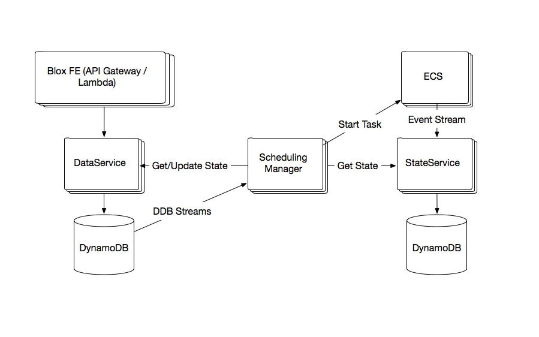

# Daemon Scheduler Infrastructure

This document explores the feasibility of running the blox schedulers serverless on top of AWS API Gateway and Lambda. Previously we considered running blox on ECS ([see design](https://github.com/blox/blox/blob/dev/docs/daemon_design.md)). Here are some advantages of running on Lambda instead:

* There is no need to maintain EC2 fleets.
* Simpler architecture. Previously, we considered having one ECS cluster per customer each cluster hosting manager tasks belonging to that customer. The clusters would be created for customers at the time of first blox environment creation ([see design for details](https://github.com/blox/blox/blob/dev/docs/daemon_design.md)). We also considered having warmpools of ECS instances to bring down cluster startup times. To manage the lifecycle of scheduling managers and ensure there are healthy and available, we needed to have a manager controller service overseeing the creation and health of manager tasks (instead of running the managers as an ECS service to avoid bootstrapping problems of the scheduler running on the scheduler). By running the scheduling managers on Lambda, manager functionality can be invoked on demand and the setup and maintenance of the controller-manager cluster infrastructure becomes unnecessary.
* Removes a circular dependency of the scheduler running on itself and the complications it would cause during bootstrapping.

## Architecture



Frontend will consist of API Gateway and Lambda. API Gateway is responsible for authN, authZ, throttling, defining a model for the API and input validation. Lambda will implement the business logic. We can use IAM for authN and authZ for the remaining services and use POJOs and interfaces for API models.

We will have one Lambda function per service and handle routing inside the Lambda function by parsing the url passed in through API Gateway. This allows us to handle our services as REST services and include all the dependencies and shared code in one zip file instead of one zip file per API (as to deploy to Lambda you need to zip up your code and upload it to Lambda). It also simplifies versioning and deployment to Lambda.

API calls (to DataService, SchedulingManager, StateService) will be handled by synchronous Lambda invocations. We will also use Lambda to process DynamoDB streams. Monitoring of pending and in-progress events will be handled by Lambda functions invoked through scheduled cloudwatch events. Deployments in the scheduling manager will be performed as a workflow using Stepfunctions and Lambda.

### Lambda Synchronous Calls

All APIs will be handled as synchronous calls to Lambda. The invocation can fail with Handled and Unhandled errors. Unhandled errors are errors reported by the Lambda service and not the Lambda function such as out of memory and function timeouts. Handled exception stack traces will be serialized into JSON and returned to the caller.

### Lambda invoked by Cloudwatch Events

Scheduled Cloudwatch events will be used to invoke a Lambda function on a schedule to perform monitoring on the DataService pending and in-progress deployments. Cloudwatch events cannot be triggered more frequently than once per minute.

Cloudwatch events with a Lambda integration will also be used to process the ECS event stream.

Both scheduled Cloudwatch events and Cloudwatch events generated from the ECS event stream  invoke Lambda asynchronously. Asynchronous functions are retried twice and if not successful, the failed event can be sent to a dead letter queue (see [Lamdba docs](http://docs.aws.amazon.com/lambda/latest/dg/retries-on-errors.html)).

If the monitoring function fails, the deployment state will not be updated and pending deployments that weren't handled by the DynamoDB stream processor will not be picked up. If the reason for the failure is Lambda availability, then events will start succeeding once Lambda is back up. Otherwise, we need to monitor on dead letter queue size and figure out why the processing of records is failing. The reason might also be StepFunctions availability since workflows will be started from monitoring Lambda functions. (TODO: what is the recorded payload in the DLQ?)

### Lambda to handle DynamoDB Streams

DynamoDB streams can be handled by Lambda or Kinesis. When using Lambda to read from a stream we need to create a Lambda function that simply processes the received records. Lambda subscribes to the stream and polls it behind the scenes. Lambda allows you to specify the max batch size which will be the maximum number of records passed to our Lambda function at the time of invocation. Increasing the batch size will cause fewer invocations but with more records processed per invocation. The request rate at which Lambda polls the streams is:

```
number of concurrent executions (number of shards) / function duration
```

If the function processing the records fails, Lambda will retry the entire batch until the records expire, which, for DynamoDB streams, is currently 24 hours. The exception is treated as blocking, and AWS Lambda will not read any new records from the stream until the failed batch of records either expires or is processed successfully. This means that we will occasionally process events twice and need to be able to handle that properly. The scheduling manager will verify the deployment state from the dataservice before processing it and will not continue with the deployment if its status has changed from "pending" so processing deployment records twice should not be a problem. However, we still need to monitor Lambda functions that get stuck processing the stream. Since the DynamoDB streams are not partitioned by customer, to prevent blocking the stream and affecting other customers if there's a problem with one deployment, we should record the failure and mark it as successfully processed.

DynamoDB stream records are partitioned into shards, which are just containers around multiple stream records. Lambda will invoke one function per shard. DynamoDB streams are ordered within a shard, however, DynamoDB creates shards automatically and events are not ordered across shards. That means if someone submits a deployment and then submits another deployment, they might end up on different shards and Lambda might process them out of order. However, because there can only be one pending deployment, the second request will set the first deployment record to cancelled. So when the scheduling manager retrieves the deployment record, even if received out of order, the first pending deployment will have been cancelled.

It's possible that DynamoDB stream records will expire while Lambda is unavailable. Since monitoring workflows will pick up the pending deployments missed by not processing the stream records, no manual action will be required to recover.

### Lambda in StepFunctions

StepFunctions allows retry and catch steps in the workflow definition. If the Lambda function fails it's redirected to its appropriate retry state and retried the defined number of times with backoff ([see docs](http://docs.aws.amazon.com/step-functions/latest/dg/how-step-functions-works.html)). If Lambda is unavailable, the workflow states will be retried and eventually fail. That means that deployments might stop in the middle of the workflow. We might end up in a state where the deployment has been moved to in-progress but no tasks have been started on it. The in-progress deployments will eventually be timed out by the monitor workflows.

## Concerns

### Coldstarts

Lambda brings up new containers containing the function code on demand. Containers stick around if the function is invoked frequently however all containers are periodically restarted regardless of load. The first call on a new container is slow because the code has to be downloaded, unzipped and initialized. We have some mitigation strategies as warming up containers by periodically invoking all code paths, however the containers will still be recycled once in a while so we need to keep the function and its dependencies as small as possible. Spring, in particular, seems to have high initialization times so we're looking at alternative frameworks.

### Limits

Lambda has a 5 min execution limit. Most of our lambda functions are short-lived, the only functions that are going to be long running are the monitoring functions that iterate over all environments and create workflows for each environment/deployment. To minimize execution time and blast radius we should break up the records into batches and invoke multiple Lambda functions to process them.

There is a limit on the size of the zipped code that can be uploaded (50MB) so we need to be careful with the dependencies that we include.

The limit for concurrent Lambda executions is 1000, which we, most likely, will need to raise.

### Scaling

It's not obvious how Lambda scales, however, if there is a sudden call spike EC2 coldstart times might slow down scaling and affect latency. According to some experimentation synchronous calls are prioritized, however, calls scheduled through Cloudwatch events (monitoring, etc) might experience a significant slowdown (15 mins in some cases).

### Availability

In case of a Lambda outage all blox services will be unavailable. Tasks that are already running on ECS will not be impacted but customers will not be able to start/stop deployments and in-progress deployments will stop for the duration of the outage. If we only use Lambda on the frontend and host other services on ECS, customer calls such as startDeployment and createEnvironment will be impacted in case of a Lambda outage, however, the scheduling managers will continue in-progress deployments and lifecycle management, such as, deploying a task on a newly added instance to the cluster. Customers will not be able to stop in-progress deployments in case they erroneously deployed something to production. Since customers will have no control over in-progress deployments in either case, one does not seem an obviously better choice than the other.

### Metrics

Not managing infrastructure comes with pros and cons. The disadvantage is that we don't get host level visibility or metrics and have to rely on Lambda to keep everything running smoothly.

We can, however, generate metrics from our Lambda functions and send them to Cloudwatch metrics. The challenges with that approach are increased latency with synchronous calls to cloudwatch and also pretty low throttling levels from cloudwatch. To avoid missing metrics we can publish metrics into logs and parse the logs asynchronously.

## Useful Links

* [Lambda Error Handling](http://docs.aws.amazon.com/lambda/latest/dg/retries-on-errors.html)
* [Lambda Concurrent Executions](http://docs.aws.amazon.com/lambda/latest/dg/concurrent-executions.html)
* [StepFunctions Error States](http://docs.aws.amazon.com/step-functions/latest/dg/how-step-functions-works.html)
