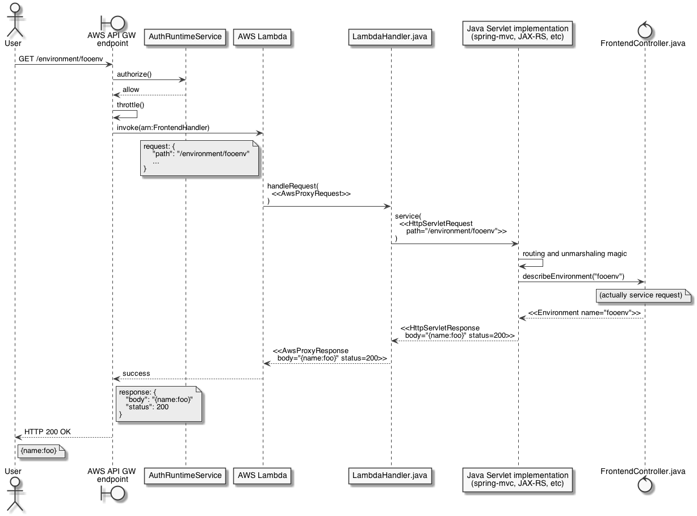

# Blox frontend

The purpose of the frontend is to provide a single HTTP endpoint to call Blox, where we can enforce authentication, authorization, throttling, logging, and other common concerns.

## Architecture
The frontend is structured as a single AWS API Gateway API ("API"), which dispatches all HTTP requests to it to a single handler lambda function using AWS_PROXY mode.

In this mode, API Gateway serializes details about the HTTP request, caller identity, and other context information into a single JSON message that is provided as the input to the lambda function. The lambda function in turn serializes all information about the HTTP response it wants to send, and returns that to API Gateway, which turns it back into a raw HTTP response.

The lambda function itself is implemented using `aws-serverless-java-container`, which implements the Java Servlet spec using these JSON messages, modeled as a `RequestHandler<AwsProxyRequest, AwsProxyResponse>`. This lets us use any Servlet-compatible java web library supported by the container to define our HTTP API.

Since API Gateway supports defining APIs using Swagger models, and some Java web frameworks support generating Swagger models from Java code that implements a RESTful controller, we can just write our RESTful controller, and use the generated Swagger models to simultaneously define our API.

## Why?
### Why a single lambda function?
The conventional way to use Lambda with API Gateway is to have a separate lambda function for each operation in the API. Each function has to be wired up to its corresponding API operation by ARN through custom Swagger extensions.

Lambda also supports wiring up multiple API operations to the same lambda function, and then exposes the original HTTP request to the lambda function. Using this approach unlocks some big benefits:

* Our Cloudformation template and Swagger model are simpler. Since all operations are wired up to a single lambda function, there's only one value to wire through to the Swagger model.
* It's easier to reason about deployments. Since we only have two AWS resources (the API and the Lambda function) we can easily version them for more deterministic deployment.
* It improves active container reuse. If low-volume and high-volume API calls share the same Lambda function, that function is more likely to be "warm" already. If the low-volume call uses its own lambda function, it's less likely to be dispatched to an active container.

### Why use a Servlet implementation in the lambda function?
Instead of using `aws-serverless-java-container` and using a Servlet implementation, we could write some of our own glue code to correctly call the right code in response to incoming API calls. However, using a Servlet implementation that supports writing RESTful controllers has some compelling benefits:

* We can use mature, third party web frameworks like SpringMVC or JAX-RS to do HTTP routing, so we have to write less code.
* It's easy to automatically generate Swagger models from the controllers and use those to define our API from CloudFormation (so there's nothing to manually keep in sync).
* For local development, we can run the web server locally like a normal Servlet using Tomcat/Jetty/etc.

